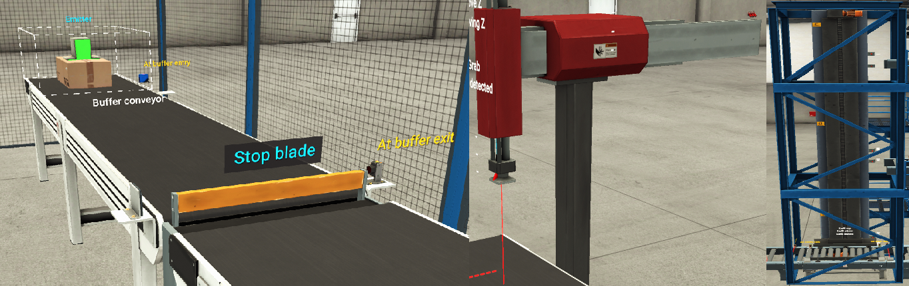

# PLC_SCL_Motion_Control_Example
Example of SCL implementation for Factory IO Visualization



# About
Programs are fully tasted, presentation in links below: <br>
<strong> Motors </strong> - https://youtu.be/4IpL4g8xc78 <br>
<strong> Buffer </strong> - https://youtu.be/2GMKlQcdnh8 <br>
<strong> Robot </strong> - https://youtu.be/8n3IqwYy8-M <br>
<strong> Elevator </strong> - https://youtu.be/UR9_qP7CrKQ


# Tools

<strong> TiaPortal </strong> <br>
<strong> S7-PLCSIM Advanced </strong>


# Functions require appropriate calls as needed 
## Example Call 

```SCL
"Entry_Conveyor_DB"(Request_Run := NOT "Sensor_1" OR NOT "Sensor_2",
                    Request_Stop := NOT "Sensor_2" AND
                    "Buffer_Conveyor_DB".Request_Stop,
                   Time_Run := T#20s,
                   Stop_Delay := T#0s,
                   MotorStatus => "Entry_Motor_RUN");

"Buffer_Conveyor_DB"(Request_Run := NOT "Sensor_2" AND "Sensor_3",
                     Request_Stop := NOT "Sensor_3",
                     Time_Run:= T#20s,
                     Stop_Delay:= T#0s,
                     MotorStatus => "Buffer_Motor_RUN");

